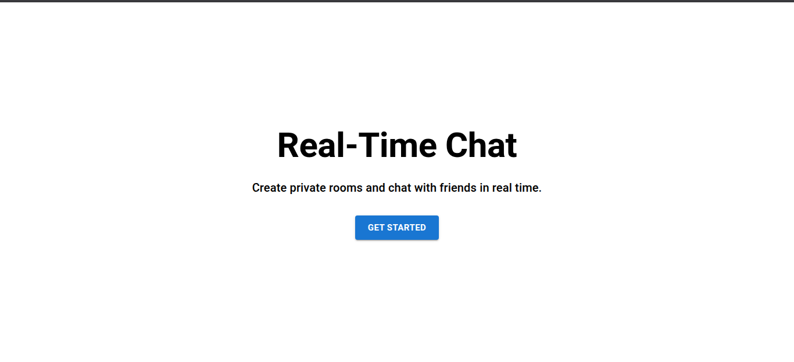
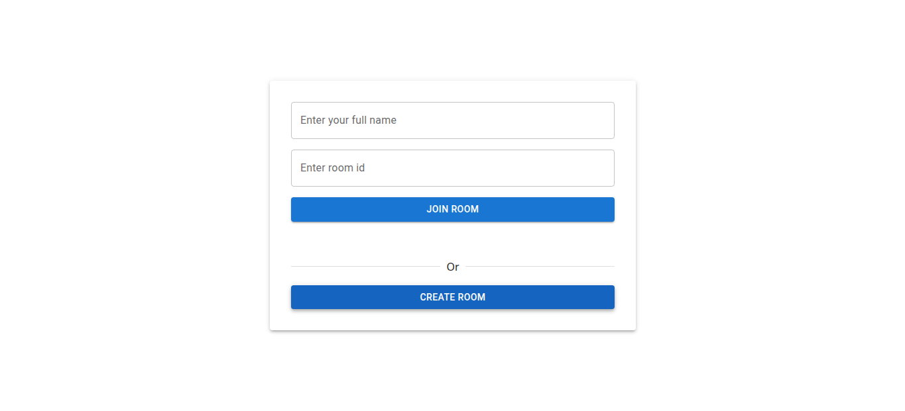
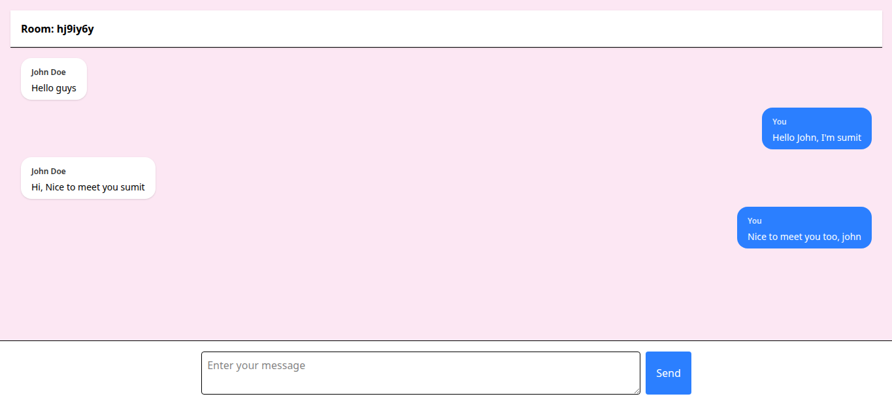
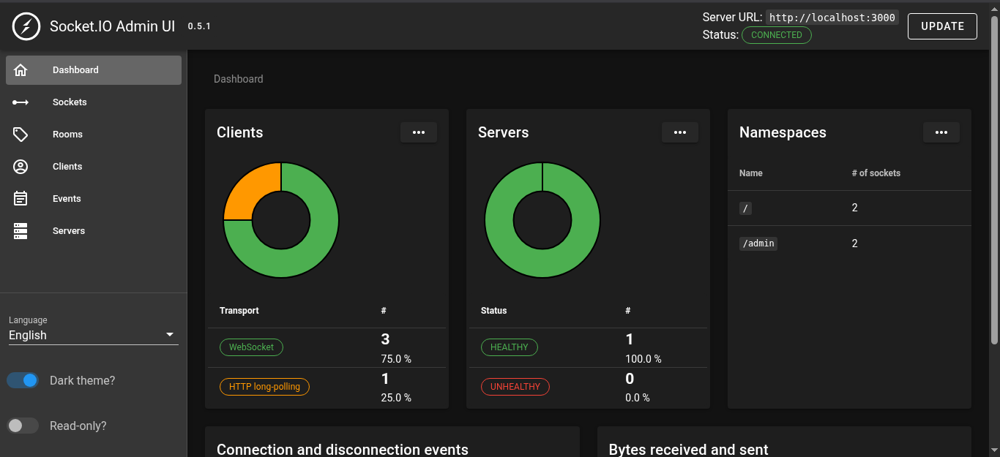

# Real-Time Chat Application

A real-time chat application built using React, Socket.IO, Express.js, and MongoDB. The application allows users to create private chat rooms, join existing rooms, exchange messages instantly, and view previous chat history.

## Internship Details 
- **Full Name:** Sumit Vitthal Desai
- **Intern ID:** CITS1120 
- **Duration:** 6 Weeks 
- **Project Name:** Real-Time Chat Application

---

## Project Scope

The objective of this project was to learn and implement real-time communication using WebSockets while understanding full-stack application development.

Users can:

* Create private chat rooms.
* Join existing rooms using a room ID.
* Send and receive messages instantly.
* View previous messages stored in the database.
* Communicate with multiple users inside the same room.

---

## Features

* Real-time messaging using Socket.IO.
* Create unique chat rooms.
* Join existing chat rooms.
* Persistent chat history using MongoDB.
* Room-based communication.
* Username support.
* Responsive user interface.
* Automatic retrieval of previous messages when joining a room.

---

## Tech Stack

### Frontend

* React.js
* React Router DOM
* Tailwind CSS
* Material UI

### Backend

* Node.js
* Express.js
* Socket.IO

### Database

* MongoDB
* Mongoose

---

## Project Structure

```text
ChatApplication/
│
├── client/
│   ├── src/
│   │   ├── components/
│   │   |   ├── ChatPage.jsx
|   |   |   ├── Home.jsx
|   |   |   └── JoinRoom.jsx
│   │   └── App.jsx
│   │   
│   │
│   └── package.json
│
├── server/
│   ├── model/
│   │   └── message.model.js
│   │
│   ├── server.js
│   └── package.json
│
└── README.md
```

---

## Installation & Setup

### Clone Repository

```bash
git clone https://github.com/SumitDesai-21/ChatApplication.git
cd ChatApplication
```

### Frontend Setup

```bash
cd client
npm install
npm run dev
```

### Backend Setup

```bash
cd server
npm install
npm run dev
```

### Environment Variables

Create a `.env` file inside the server directory:

```env
MONGO_URL=<MongoDB Connection String>
```

---

## Application Workflow

### Creating a Room

1. User enters their name.
2. User clicks "Create Room".
3. Server generates a unique room ID.
4. User is automatically redirected to the chat room.

### Joining a Room

1. User enters their name.
2. User enters an existing room ID.
3. User joins the room.
4. Previous room messages are loaded from MongoDB.

### Sending Messages

1. User enters a message.
2. Frontend emits a `send-message` event.
3. Server stores the message in MongoDB.
4. Server broadcasts the message to all users in the room.
5. Messages appear instantly without page refresh.

---

## Socket.IO Events

### Client → Server

```text
create-room
join-room
send-message
get-room-history
```

### Server → Client

```text
room-created
room-history
message-sent
message-received
```

---

## Database Schema

### Message

```javascript
{
  sender: String,
  text: String,
  roomId: String,
  createdAt: Date
}
```

---

## Key Concepts Implemented

* WebSocket Communication
* Event-Driven Architecture
* Socket.IO Rooms
* Real-Time Data Transfer
* MongoDB Data Persistence
* React Hooks
* Client-Server Communication
* Room-Based Messaging

---

## Output Images

### Home Page



### Join Room Page



### Chat Room



### Socket.IO Admin Dashboard



---

## Learning Outcomes

Through this project, I learned:

* How WebSockets differ from traditional HTTP communication.
* Building real-time applications using Socket.IO.
* Managing room-based communication.
* Persisting chat data using MongoDB.
* Using React Hooks for state and lifecycle management.
* Handling real-time events between frontend and backend.

---

## Author

**Sumit Desai**
